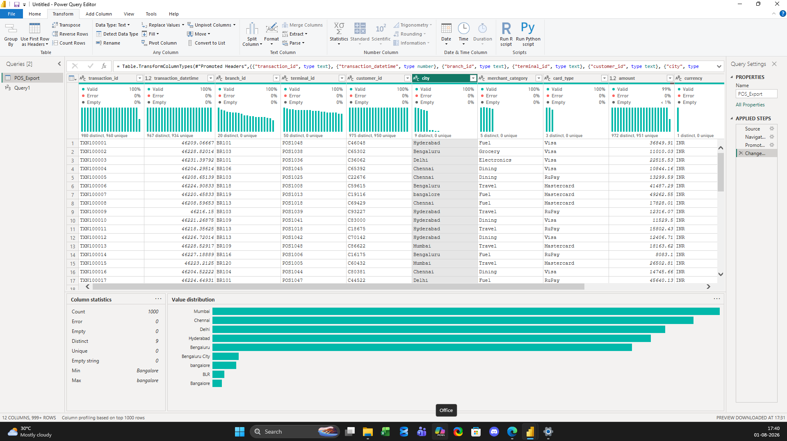
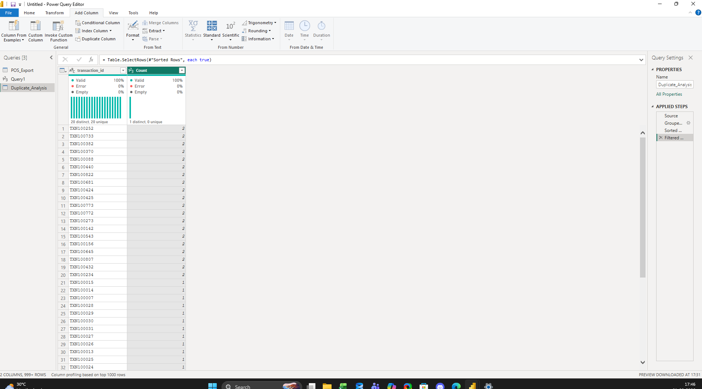
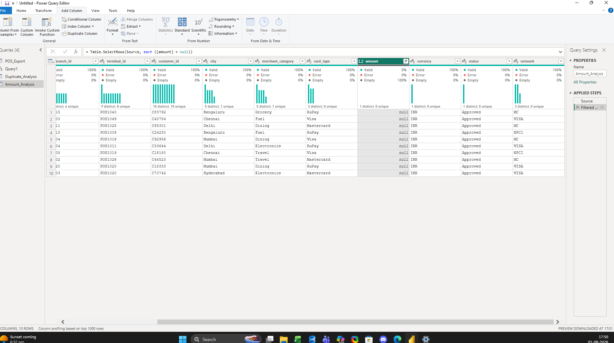
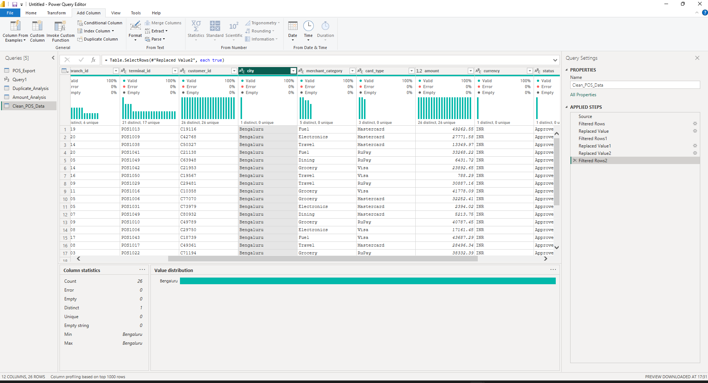
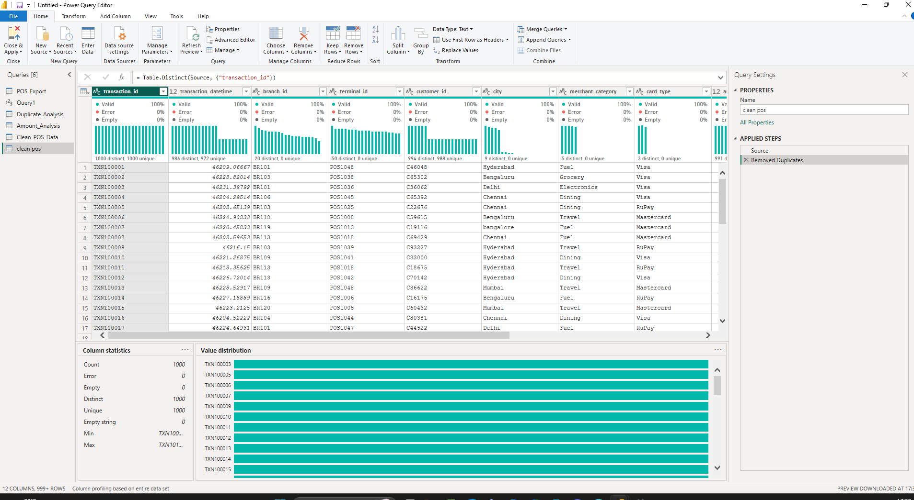

# 🏦 Day 84 – Banking POS Data Reconciliation using Power Query

> **Business Scenario**
>
> The Finance team at a bank identified a **2% reconciliation mismatch** between the monthly settlement report and a legacy POS transaction export. In this project, I investigated the issue, cleaned the data using Power Query, validated the results, and prepared a reporting-ready dataset.

---

# 🎯 Project Objectives

- Audit the quality of the raw dataset.
- Investigate duplicate transactions.
- Identify missing values and inconsistent city names.
- Clean the dataset using Power Query.
- Validate the final dataset before reporting.

---

# 📊 Dataset Overview

| Attribute | Value |
|-----------|------:|
| Industry | Banking |
| Tool | Power BI (Power Query) |
| Original Transactions | 1,000 |
| Imported Rows | 1,020 |
| Duplicate Transactions | 20 |
| Missing Amount Values | 10 |

---

# 🔄 Project Workflow

```text
Import Dataset
      │
      ▼
Data Quality Audit
      │
      ▼
Root Cause Analysis
      │
      ▼
Data Cleaning
      │
      ▼
Validation
      │
      ▼
Business Ready Dataset
```

---

# 📌 Task 1 – Data Quality Audit

### What I Did

- Imported the banking POS dataset into Power Query.
- Reviewed column names and data types.
- Enabled Column Quality, Distribution, and Profile.
- Identified duplicate transactions, missing values, and inconsistent city names.

### 📷 Project Evidence



---

# 📌 Task 2 – Root Cause Analysis

### What I Did

- Grouped data by **Transaction ID**.
- Identified **20 duplicate Transaction IDs (~2%)**.
- Investigated missing Amount values.
- Documented findings before applying any transformations.

### 📷 Project Evidence





---

# 📌 Task 3 – Data Cleaning

### What I Did

- Standardized inconsistent city names.
- Removed verified duplicate transactions.
- Preserved missing Amount values for review.
- Validated the cleaned dataset.

### 📷 Project Evidence





---

# 📌 Task 4 – Validation Summary

| Metric | Before | After |
|---------|--------:|------:|
| Total Rows | 1,020 | 1,000 |
| Duplicate Transactions | 20 | 0 |
| Invalid City Names | 30 | 0 |
| Missing Amount Values | 10 | 10 *(Needs Review)* |

---

# 🛠 Skills Practiced

- Power Query
- Data Profiling
- Group By
- Replace Values
- Remove Duplicates
- Data Validation
- Data Cleaning
- Financial Reconciliation

---

# 📂 Repository Structure

```text
day84_banking_pos_reconciliation/
│
├── README.md
├── day84_banking_pos_reconciliation.pbix
├── bank_pos_transactions_dirty.csv
├── 01_data_quality_audit.png
├── 02_duplicate_analysis.png
├── 03_amount_quality_analysis.png
├── 04_city_standardization.png
└── 05_duplicate_removal.png
```

---

# 🌱 What I Learned

Through this project, I learned how to:

- Profile raw business data before making changes.
- Investigate data quality issues using evidence.
- Remove duplicate records safely.
- Standardize inconsistent data.
- Validate the final dataset before reporting.
- Document an end-to-end Power Query workflow using a real business scenario.
