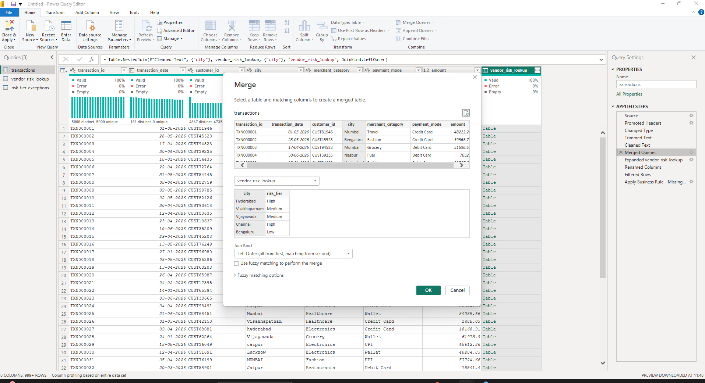
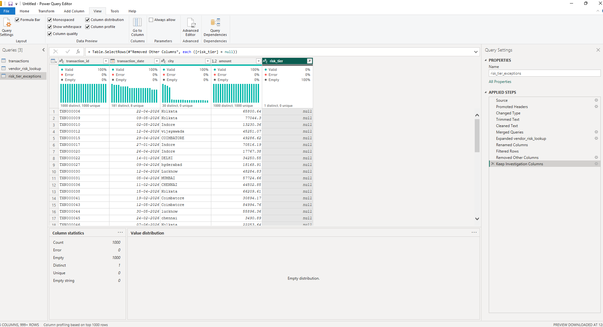
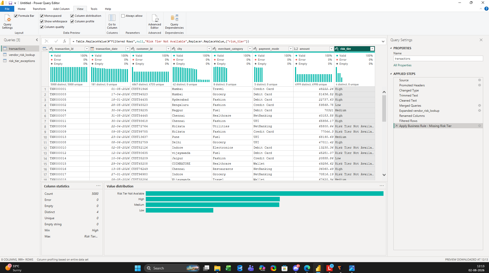

# Day 85 – Merge Queries with Exception Reporting in Power Query

## 📌 Business Problem

A financial institution receives daily banking transaction data along with a third-party city-level fraud risk lookup dataset. Due to inconsistent city names, formatting differences, and missing lookup records, some transactions cannot be assigned a fraud risk tier after merging. If these unmatched records are not identified before reporting, business users may receive incomplete or misleading insights.

---

## 🎯 Objective

- To standardize the join key before merging the datasets.
- To enrich transaction data with fraud risk information.
- To validate the merge results by identifying unmatched records.
- To create an exception report for data quality investigation.
- To apply a business rule that improves reporting clarity.

---

## 🏢 Business Scenario

The Risk Analytics team receives transaction data from the banking system and a fraud risk lookup file from an external vendor. Before publishing reports, every transaction should be matched with its corresponding fraud risk tier. Any unmatched records should be identified, investigated, and handled appropriately instead of being silently ignored.

---

## 📂 Dataset

| File | Description |
|------|-------------|
| **transactions.csv** | Banking transaction dataset containing customer transaction details. |
| **vendor_risk_lookup.csv** | Third-party lookup dataset containing city-level fraud risk tiers. |

---

## 🛠️ Activities Performed

During this practice project, I completed the following activities:

- Imported **transactions.csv** and **vendor_risk_lookup.csv** into Power Query.
- Reviewed both datasets to understand their structure and identify the common join key.
- Standardized the **City** column by applying **Trim** and **Clean** transformations in both datasets.
- Performed a **Left Outer Join** using the **City** column to retain every transaction while retrieving the corresponding **risk_tier** from the vendor lookup.
- Expanded only the required **risk_tier** column after the merge.
- Validated the merge results by checking the **risk_tier** column for unmatched records using Power Query profiling features.
- Created a separate **risk_tier_exceptions** query by duplicating the merged dataset and filtering records where **risk_tier** was **null**.
- Retained only the investigation columns (**transaction_id, transaction_date, city, amount, and risk_tier**) in the exception report.
- Applied the business rule by replacing **null** values with **"Risk Tier Not Available"** in the reporting dataset.
- Produced a reporting-ready dataset while maintaining a separate exception report for data quality investigation.

---

## 🔄 Workflow

```text
Import Datasets
      │
      ▼
Review Data Structure
      │
      ▼
Standardize Join Keys
(Trim & Clean)
      │
      ▼
Merge Queries
(Left Outer Join)
      │
      ▼
Expand risk_tier
      │
      ▼
Validate Merge Results
      │
      ▼
Create Exception Report
      │
      ▼
Apply Business Rule
      │
      ▼
Reporting-Ready Dataset
```

---

# 📸 Project Screenshots

## 1️⃣ Power Query Merge Configuration



Configured a **Left Outer Join** between the transaction dataset and the vendor lookup using the **City** column.

---

## 2️⃣ Risk Tier Exception Report



Validated the merge results by identifying transactions that did not receive a matching fraud risk tier and prepared an exception report for further investigation.

---

## 3️⃣ Final Reporting Table



Applied the business rule by replacing missing values with **"Risk Tier Not Available"**, producing a reporting-ready dataset.

---

## 💼 Business Outcome

The project produced a reporting-ready transaction dataset enriched with fraud risk information from a third-party lookup table. Unmatched records were identified before the dataset was finalized, an exception report was created for investigation, and a business rule was applied to replace missing values with **"Risk Tier Not Available"**. These activities improved reporting transparency and demonstrated a structured approach to data validation and exception handling.

---

## 🎓 Key Learning

Through this project, I:

- Learned how to standardize join keys before merging datasets.
- Practiced performing Merge Queries using a Left Outer Join.
- Understood the importance of validating merge results before publishing reports.
- Built an exception report to support data quality investigation.
- Applied business rules to improve reporting clarity.
- Strengthened my understanding of enterprise-style Power Query transformation workflows.

---

## 📈 Project Summary

This practice project focused on building an enterprise-style Merge Queries workflow in Power Query. I standardized join keys, merged transaction data with a third-party lookup table, validated the merge results, created an exception report for unmatched records, and applied a business rule to prepare a reporting-ready dataset. The project strengthened my practical understanding of data quality validation, exception handling, and Power Query transformations.

---

## 🛠️ Skills Demonstrated

- Power BI
- Power Query
- Merge Queries
- Left Outer Join
- Data Cleaning
- Data Validation
- Exception Reporting
- Data Quality
- Business Rules
- ETL
- Analytical Thinking
