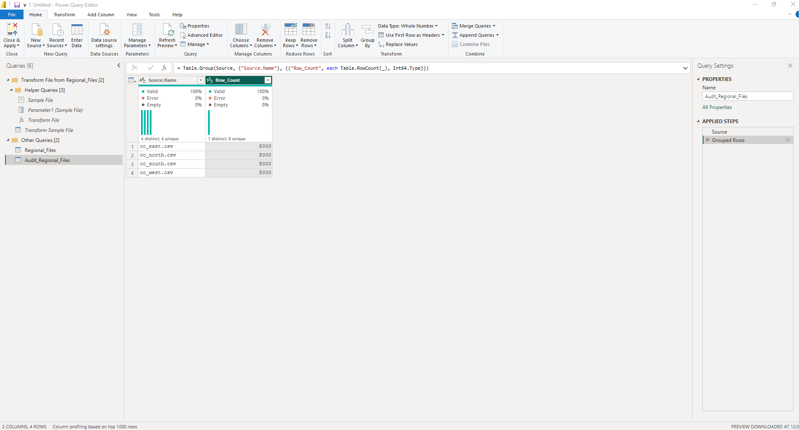

# 🚀 Day 86 – Power Query Folder Import, Schema Drift & Audit Validation

> **📖 Learning Focus:** Power Query • Folder Import • Combine Files • Transform Sample File • Audit Validation • Schema Drift Awareness
>
> This project is part of my **120 Days Data Analyst GitHub Worklog**, where I consistently practice real business scenarios to strengthen practical Data Analytics skills and build an interview-ready portfolio.

---

## 📌 Business Problem

Regional offices send monthly transaction files using a common template, but the files are not always consistent. One region may include additional columns, another may change the column order, and occasionally a regional office may fail to upload its monthly file.

The reporting process requires an automated solution that combines all regional files while making missing source files visible before reports are shared with stakeholders.

---

## 🎯 Objective

- To automate the import of multiple regional CSV files using a Folder connection.
- To standardize reusable data transformations using Power Query.
- To validate imported source files through an audit query.
- To simulate a missing regional file and verify the reporting process.

---

## 🏢 Business Scenario

A financial reporting team receives monthly credit card transaction files from North, South, East, and West regional offices.

The business requires a single reporting dataset that automatically includes new monthly files while reducing manual effort. The reporting solution also needs to help analysts identify missing regional uploads before publishing reports.

---

## 📂 Dataset

### Dataset Type

Regional Credit Card Transaction Files (CSV)

### Files Included

- cc_north.csv
- cc_south.csv
- cc_east.csv
- cc_west.csv

### Dataset Highlights

- Approximately **20,000** transaction records
- Folder-based data import
- Inconsistent text formatting across regional files
- Extra `branch_code` column in one regional file
- Different column order in one regional file
- Missing regional file simulation for audit validation

---

## 🛠️ Activities Performed

During this hands-on practice project, I built a folder-based Power Query solution to automate the monthly import of regional transaction files.

I imported multiple CSV files using a **Folder** connection and explored how Power Query automatically generated helper queries to support reusable transformations.

I standardized text values by applying reusable transformations inside **Transform Sample File**, allowing the same cleaning logic to be applied consistently across every regional file.

After combining all regional files into a single dataset, I verified the imported sources using the **Source.Name** column and created a separate audit query to monitor the files included during each refresh.

Finally, I simulated a missing regional file by temporarily removing one CSV file and refreshing the report. This practice helped me understand how simple validation techniques can detect missing source data before reports are shared with stakeholders.

---

## 🔄 Workflow

```text
Regional CSV Files
        │
        ▼
Get Data → Folder
        │
        ▼
Combine & Transform Data
        │
        ▼
Transform Sample File
(Standardized Cleaning)
        │
        ▼
Regional_Files
(Combined Dataset)
        │
        ▼
Audit_Regional_Files
(Group By Source.Name)
        │
        ▼
Detect Missing Regional Files
```

---

## 📸 Project Screenshot

### Audit Query Validation



**Description**

Created an audit query by grouping records using **Source.Name** and counting rows to verify imported regional files.

This validation confirmed which regional files were successfully loaded into the reporting dataset and demonstrated how a missing regional file could be detected before publishing business reports.

---

## 💼 Business Outcome

A reusable folder-based import process was successfully built for combining multiple regional transaction files into a single reporting dataset.

The solution reduced manual file imports, standardized data preparation, and introduced an audit validation process that helped identify missing regional files before reports were published.

This practice project demonstrated how simple data validation techniques can improve the reliability of business reporting.

---

## 🎓 Key Learning

This project strengthened my understanding of enterprise-style Power Query workflows.

Through hands-on practice, I understood how **Folder Import** supports scalable data ingestion, how **Transform Sample File** enables reusable transformations, and how the **Source.Name** column can be used to validate imported files.

Creating an audit query and simulating a missing regional file also demonstrated the importance of verifying incoming data before publishing business reports.

Overall, this project improved both my technical understanding of Power Query and my ability to think about data quality from a business perspective.

---

## 📈 Project Summary

In this project, I practiced building an automated Power Query solution for combining multiple regional CSV files into a single reporting dataset.

Instead of importing files individually, I created a scalable Folder-based workflow that automatically detected available files during refresh. I also implemented an audit query to validate imported source files and simulated a missing regional upload to better understand enterprise reporting and data quality practices.

This hands-on project strengthened my practical Power BI skills while improving my understanding of real-world business reporting workflows.

---

## 🛠️ Skills Demonstrated

- Power BI
- Power Query
- Folder Import
- Combine Files
- Transform Sample File
- CSV Import
- Data Cleaning
- Text Standardization
- Query Reference
- Group By
- Count Rows
- Audit Query
- Data Validation
- ETL Workflow
- Schema Drift Awareness
- Business Reporting
- Data Quality
- Problem Solving

---

## 📁 Project Structure

```text
day86_powerquery_folder_import_schema_drift_audit/
│
├── README.md
├── day86_powerquery_folder_import_schema_drift_audit.pbix
├── cc_north.csv
├── cc_south.csv
├── cc_east.csv
├── cc_west.csv
└── 01_audit_query_validation.png
```

---

## 📅 120 Days Data Analyst GitHub Worklog

✅ **Progress:** **Day 86 / 120 Completed**

**Current Focus:** Power Query – Folder Import, Schema Drift & Audit Validation

> Every project in this worklog represents a hands-on business scenario completed as part of my learning journey toward becoming an industry-ready Data Analyst.

---

## 👨‍💻 About Me

Hi, I'm **Saii Dheep**, an aspiring **Data Analyst** and an **MBA (Business Analytics & Data Science)** student.

I am building practical Data Analytics skills by solving real business scenarios using:

- 📊 Microsoft Excel
- 🗄️ SQL Server
- 📈 Power BI
- 🐍 Python
- 📉 Statistics
- 📋 Business Analytics

My goal is to build a strong portfolio that demonstrates consistent learning, practical problem-solving, and interview-ready analytical skills.

---

## 🤝 Connect With Me

### 💼 LinkedIn

https://www.linkedin.com/in/saideeppallela

### 💻 GitHub

https://github.com/saideeppallela

---

## ⭐ Thank You

Thank you for taking the time to explore this project.

If you found this repository helpful or interesting, please consider **starring ⭐ the repository**.

Your support motivates me to continue learning, building, and sharing practical Data Analytics projects through my **120 Days Data Analyst GitHub Worklog**.

---

