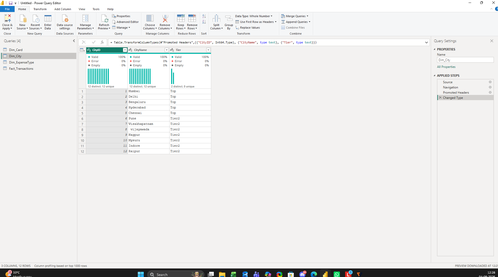
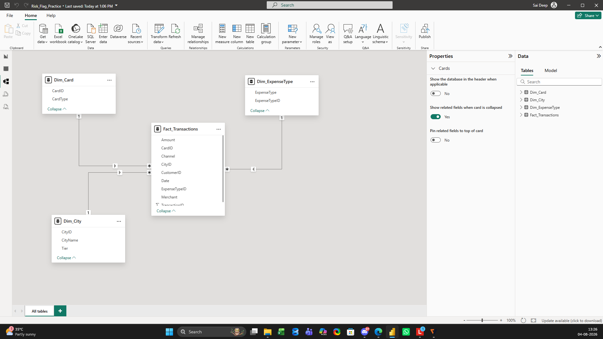
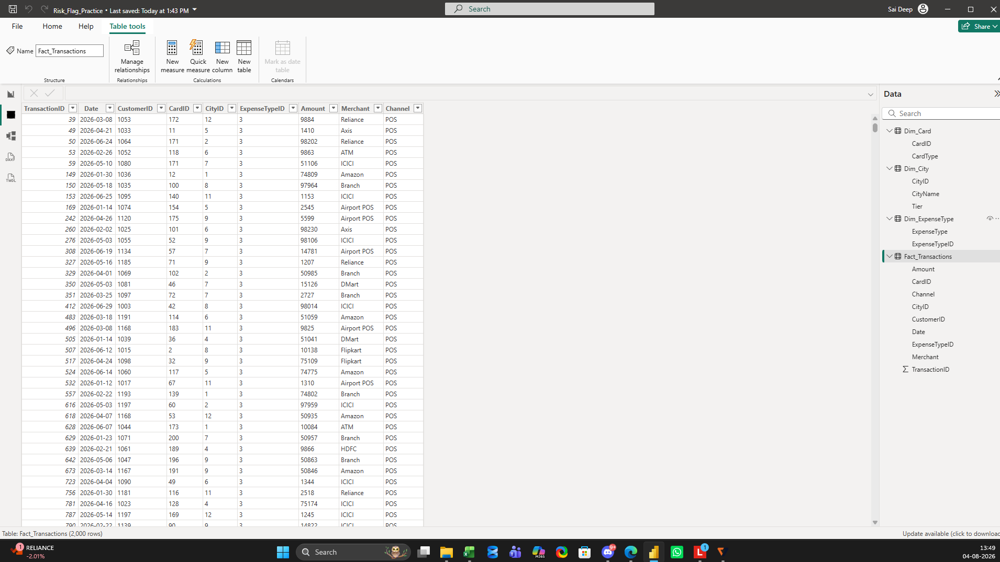

# Day 87 – Power BI Data Preparation & Star Schema Modeling for Banking Risk Analysis

> **Learning Focus:** Power BI | Power Query | Data Cleaning | Data Validation | Star Schema | Relationship Modeling | Business Rule Analysis

This project is part of my **120 Days Data Analyst GitHub Worklog**, where I consistently practice real-world business scenarios to strengthen practical, interview-ready Data Analytics skills.

In today's project, I worked on preparing a banking transaction dataset for a future risk analysis report. Instead of immediately building reports or writing DAX, I focused on creating a clean and reliable data model that could support a complex business rule used by a bank's Risk Management team.

---

# 📌 Business Problem

A simple **Amount > 50,000** flag is not sufficient to identify risky transactions in a banking environment.

The Risk Team requires a business rule that classifies a transaction as **High Risk** when:

- The transaction amount exceeds ₹50,000 **and** the expense type belongs to specific high-risk categories such as **Cash Withdrawal** or **Wire Transfer**.

**OR**

- A **Gold Card** transaction occurs in a city that is **not** part of the bank's Top-Tier city list.

Before implementing this business logic, the underlying data must be accurate, standardized, and properly modeled.

---

# 🎯 Objective

- To import multiple business tables into Power BI.
- To clean and standardize transactional and master data.
- To validate data quality before modeling.
- To build a Star Schema suitable for future business logic.
- To prepare the dataset for banking risk analysis.

---

# 🏢 Business Scenario

A retail bank receives transaction data together with customer card information, city details, and expense classifications from multiple operational systems.

Although the datasets are related, inconsistencies such as incorrect data types, leading spaces, and inconsistent text formatting can reduce reporting accuracy.

The objective is to prepare a reliable semantic model before implementing the bank's multi-condition risk classification logic.

---

# 📂 Dataset

| Item | Details |
|------|---------|
| **Dataset Type** | Banking Transaction Dataset |
| **Files** | 1 Excel Workbook |
| **Tables** | 4 |
| **Total Records** | 2,000 Transactions |

### Dataset Highlights

- Fact_Transactions
- Dim_Card
- Dim_City
- Dim_ExpenseType

The dataset intentionally included minor data quality issues to simulate practical data preparation activities commonly performed before enterprise reporting.

---

# 🛠️ Activities Performed

### Imported Multiple Related Tables

Imported four related business tables into Power BI through Power Query to prepare the data before building reports.

---

### Reviewed Data Quality

Inspected the imported tables to identify:

- Data types
- Text inconsistencies
- Blank values
- Duplicate keys
- Applied query steps

This ensured the data structure was understood before making transformations.

---

### Standardized City Information

The City dimension contained inconsistent text formatting.

To improve consistency:

- Removed leading and trailing spaces.
- Standardized capitalization.

These transformations help prevent inconsistent filtering and improve report readability.

---

### Corrected Data Types

Validated important business columns and assigned appropriate data types for:

- Date
- Amount
- Transaction ID

Correct data types improve model reliability and support future calculations.

---

### Validated Dimension Keys

Verified that each dimension table contained:

- No blank primary keys
- No duplicate primary keys

This validation ensured that relationships could be created correctly.

---

### Built a Star Schema

Created relationships between:

- Fact_Transactions
- Dim_Card
- Dim_City
- Dim_ExpenseType

The model followed a standard Star Schema design using:

- One-to-Many Relationships
- Single Cross Filter Direction
- Active Relationships

This structure provides a scalable foundation for future DAX calculations and reporting.

---

### Analyzed the Business Rule

Reviewed the banking risk requirement before implementation.

Instead of immediately writing DAX, I first analyzed the business logic to understand how multiple conditions combine to classify a transaction as High Risk.

This approach reflects how business requirements are interpreted before technical implementation.

---

# 🔄 Workflow

```text
Business Requirement
        │
        ▼
Import Dataset
        │
        ▼
Inspect Data Quality
        │
        ▼
Clean & Standardize Data
        │
        ▼
Validate Data Types
        │
        ▼
Verify Primary Keys
        │
        ▼
Create Star Schema
        │
        ▼
Review Business Rule
        │
        ▼
Dataset Ready for Risk Analysis
```

---

# 📸 Project Screenshots

## 1️⃣ Initial Power Query Review



Performed an initial inspection of all imported tables to verify data quality, review data types, and identify inconsistencies before starting the data preparation process.

---

## 2️⃣ Star Schema Data Model



Built a Star Schema by connecting the fact table with the dimension tables using validated one-to-many relationships, creating a scalable data model for future reporting and analysis.

---

## 3️⃣ Dataset Ready for Business Rule



Verified that the cleaned and transformed dataset was successfully loaded into the Power BI model and prepared for implementing the banking risk classification business rule.

---
# 💼 Business Outcome

The banking dataset was successfully prepared for enterprise reporting by improving data quality, validating relationships, and creating a scalable data model.

The resulting model is now ready for implementing complex risk classification logic during the DAX phase.

---

# 🎓 Key Learning

- Understood why business requirements should be analyzed before implementation.
- Prepared enterprise data using Power Query.
- Standardized business data for reporting consistency.
- Validated primary keys before relationship creation.
- Built a Star Schema suitable for analytical reporting.
- Connected technical preparation with business reporting requirements.

---

# 📈 Project Summary

This project focused on preparing a banking transaction dataset for future risk analysis using Power BI. The work emphasized data quality, validation, relationship modeling, and business understanding before implementing analytical logic. The completed model provides a reliable foundation for scalable reporting and future DAX development.

---

# 🛠️ Skills Demonstrated

- Power BI
- Power Query
- ETL
- Data Cleaning
- Data Validation
- Data Modeling
- Star Schema
- Relationship Modeling
- Data Quality Assessment
- Business Analysis
- Banking Analytics

---

# 📁 Project Structure

```text
day87_powerbi_risk_data_preparation/
│
├── README.md
├── Risk_Flag_Practice.pbix
├── 01_power_query_initial_review.png
├── 02_star_schema_model.png
└── 03_ready_for_business_rule.png
```

---

# 📅 120 Days Data Analyst GitHub Worklog

**Progress:** Day 87 / 120

**Current Focus:**
Power BI Data Preparation, Power Query, Data Modeling, Business Understanding

---

# 👨‍💻 About Me

MBA (Business Analytics & Data Science) student and aspiring Data Analyst, building practical analytics skills through real-world business scenarios. My learning journey focuses on Microsoft Excel, SQL Server, Power BI, Python, Statistics, and Business Analytics while creating interview-ready portfolio projects.

---

# 🤝 Connect With Me

- 💼 **LinkedIn:**  
  https://www.linkedin.com/in/saideeppallela

- 💻 **GitHub:**  
  https://github.com/saideeppallela

- 🌐 **Portfolio:**  
  https://saiidheepanalytics.com
---

# ⭐ Thank You

Thank you for visiting my project.

If you found this repository helpful, please consider **starring ⭐ the repository** to support my learning journey and follow my **120 Days Data Analyst GitHub Worklog**.
