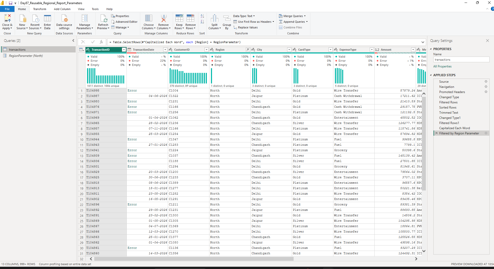
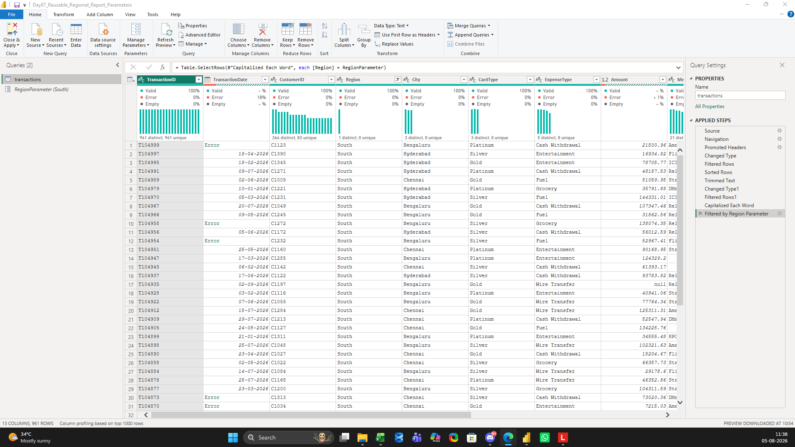
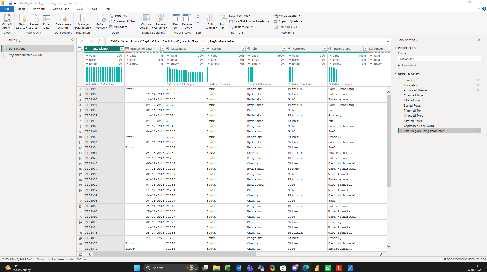

# Day 88 – Building a Reusable Power Query Pipeline Using Parameters

> **Learning Focus:** Power Query Parameters | Reusable ETL Pipeline | Dynamic Filtering | Enterprise Power BI Development | Scalable Reporting

This project is part of my **120 Days Data Analyst GitHub Worklog**, where I consistently practice solving realistic business problems to strengthen practical Data Analytics skills.

In today's project, I built a **reusable Power Query pipeline** using **Parameters**. Instead of creating multiple Power BI reports for different regional managers, I created a single parameter-driven ETL pipeline capable of dynamically filtering data for different business users.

This hands-on project helped me understand how enterprise BI teams design scalable, maintainable, and reusable Power BI solutions while improving my practical Power Query and ETL development skills.

---

# 📌 Business Problem

A company has five regional managers (North, South, East, West, and Central), each requiring the same cleaned transaction report filtered for their respective region.

Maintaining five separate Power BI reports increases maintenance effort because every future change to the data preparation logic must be repeated across all reports.

The business requires one reusable solution that applies identical transformation logic while dynamically filtering data for different regions.

---

# 🎯 Objective

- To build one reusable Power Query pipeline.
- To eliminate hardcoded region filters.
- To implement dynamic filtering using Power Query Parameters.
- To understand how enterprise BI teams create scalable ETL solutions.

---

# 🏢 Business Scenario

A national bank distributes transaction reports to multiple regional managers.

Every manager requires the same business rules, transformations, and report structure. The only difference is the business region.

Instead of maintaining multiple Power BI files, one reusable Power Query pipeline dynamically filters the required region using a parameter, reducing maintenance effort and improving report scalability.

---

# 📂 Dataset

### Dataset Type

Bank Transaction Dataset (Practice Dataset)

### Files

- `day88_transactions_parameter_practice.xlsx`

### Total Records

- Approximately **5,000+** transaction records

### Dataset Highlights

- Transaction details
- Customer information
- Regional data
- Card categories
- Expense categories
- Approval status
- Duplicate records
- Blank values
- Inconsistent Region formatting
- Mixed date formats (for future Power Query practice)

---

# 🛠️ Activities Performed

During this project, I worked through a practical business scenario focused on building a reusable Power Query pipeline.

I began by importing a bank transaction dataset into Power Query and inspecting its overall data quality before applying transformations. This helped me understand how inconsistent values and formatting issues can affect business reporting.

Next, I standardized the **Region** column by removing unnecessary spaces and applying consistent text formatting. This ensured that business filters would behave consistently across different reports.

I then created a **Power Query Parameter** named **RegionParameter** containing predefined business regions. Instead of applying a fixed Region filter, I connected the parameter directly to the M Query so the same transformation logic could dynamically return different regional datasets.

Finally, I validated the solution by changing the parameter value from **North** to **South** without modifying any transformation logic. This demonstrated how one reusable ETL pipeline can support multiple business users while reducing maintenance effort.

---

# 🔄 Workflow

```text
Business Requirement
        │
        ▼
Import Dataset
        │
        ▼
Inspect Data Quality
        │
        ▼
Standardize Region Values
        │
        ▼
Create Region Parameter
        │
        ▼
Apply Parameter in M Query
        │
        ▼
Dynamic Region Filtering
        │
        ▼
Validate Reusable Pipeline
        │
        ▼
Reusable Enterprise Reporting Solution
```

---

# 📸 Project Screenshots

## 1️⃣ Parameterized Region Filter

**Filename**

`01_parameterized_region_filter.png`



**Description**

This screenshot shows the reusable Power Query pipeline after applying the **RegionParameter** with the value **North**. The query dynamically filtered transaction data without using a hardcoded region.

---

## 2️⃣ Parameter Validation

**Filename**

`02_parameter_changed_to_south.png`



**Description**

This screenshot validates the reusable pipeline by changing the parameter value from **North** to **South**. Without modifying any transformation logic, the query automatically returned South region transactions.

---

## 3️⃣ Final Reusable Pipeline

**Filename**

`03_final_reusable_pipeline.png`



**Description**

This screenshot presents the completed reusable Power Query pipeline, including the parameter, transformation steps, and parameter-driven M Query that supports multiple regional reporting requirements.

---

# 💼 Business Outcome

A single reusable Power Query pipeline successfully supported multiple regional reporting requirements.

The solution eliminated hardcoded filters and demonstrated how parameter-driven ETL processes improve maintainability, consistency, and scalability in enterprise Power BI projects.

---

# 🎓 Key Learning

- Understood the business purpose of Power Query Parameters.
- Practiced building a reusable Power Query pipeline.
- Connected a Power Query Parameter with an M Query filter.
- Learned how dynamic filtering supports scalable reporting solutions.
- Improved practical understanding of reusable ETL development.
- Strengthened Power Query transformation and parameterization skills.

---

# 📈 Project Summary

This project focused on solving a common enterprise reporting challenge where multiple regional managers required identical reports with different regional data.

By building a reusable Power Query pipeline using Parameters, I practiced designing a scalable ETL solution that dynamically filters transaction data without duplicating transformation logic. This project strengthened my practical understanding of reusable Power BI development and enterprise data preparation techniques.

---

# 🛠️ Skills Demonstrated

- Power BI
- Power Query
- Power Query Parameters
- ETL
- Data Cleaning
- Data Transformation
- M Query
- Dynamic Filtering
- Reusable Pipeline Design
- Business Problem Solving

---

# 📁 Project Structure

```text
day88_reusable_regional_pipeline/
│
├── README.md
├── Day88_Reusable_Regional_Report_Parameters.pbix
├── day88_transactions_parameter_practice.xlsx
├── 01_parameterized_region_filter.png
├── 02_parameter_changed_to_south.png
└── 03_final_reusable_pipeline.png
```

---

# 📅 120 Days Data Analyst GitHub Worklog

### Progress

**Day 88 / 120 Completed ✅**

### Current Focus

Enterprise Power Query Development and Reusable ETL Pipeline Design

---

# 👨‍💻 About Me

I am currently pursuing an **MBA in Business Analytics & Data Science** and continuously building practical Data Analytics skills through hands-on business projects.

My learning journey focuses on applying real-world problem-solving using:

- Microsoft Excel
- SQL Server
- Power BI
- Python
- Statistics
- Business Analytics

Each project in this repository represents a practical exercise completed to improve my technical knowledge and build a strong Data Analytics portfolio.

---

# 🤝 Connect With Me

### LinkedIn

https://www.linkedin.com/in/saideep-pallela

### GitHub

https://github.com/saideeppallela

---

# ⭐ Thank You

Thank you for visiting my Day 88 project.

If you found this repository helpful, please consider giving it a ⭐. Your support motivates me to continue documenting my **120 Days Data Analyst GitHub Worklog** and sharing practical Data Analytics projects.
