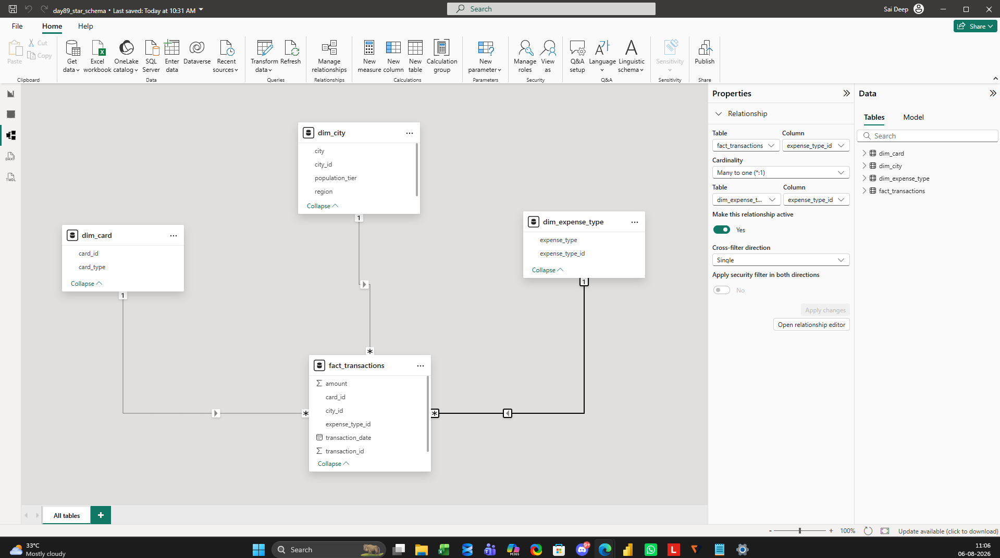
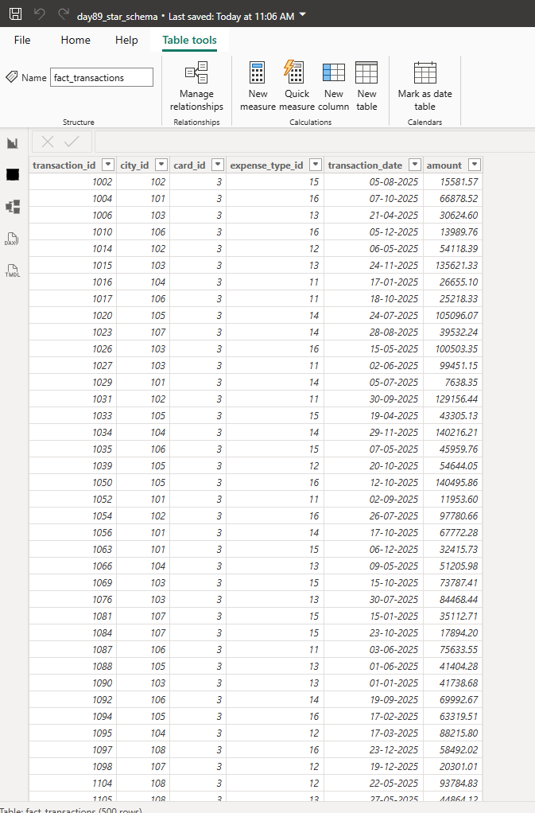

# Day 89 – Building a Star Schema Using Fact & Dimension Tables in Power BI

> **Learning Focus:** Power BI Data Modelling | Star Schema | Fact & Dimension Tables | Relationships | Cardinality | Cross Filter Direction

This project is part of my **120 Days Data Analyst GitHub Worklog**, where I consistently practice real-world business scenarios to strengthen practical Data Analytics skills. In this project, I transformed a flat credit card transaction dataset into a Star Schema by separating transactional data from descriptive business data and building a semantic model in Power BI.

---

# 📌 Business Problem

Business transaction data is often stored in a single flat table containing both transaction details and descriptive information. While this structure is easy to collect, it becomes difficult to maintain, scale, and analyze efficiently. A well-designed semantic model separates business events from descriptive attributes, making reporting more organized and scalable.

---

# 🎯 Objective

- To understand the purpose of Star Schema.
- To identify Fact and Dimension tables.
- To create relationships using primary and foreign keys.
- To understand cardinality and cross filter direction.
- To prepare a semantic model for future DAX calculations and reporting.

---

# 🏢 Business Scenario

A banking analytics team receives credit card transaction data for reporting. Instead of keeping all information in one table, the data model separates transactions from descriptive business information such as city, card type, and expense category. This structure improves data organization and supports scalable reporting.

---

# 📂 Dataset

**Dataset Type**

Credit Card Transactions (Star Schema Practice)

**Files**

- fact_transactions.csv
- dim_city.csv
- dim_card.csv
- dim_expense_type.csv

**Total Records**

- Fact Table : 500 Transactions
- Dimension Tables : 18 Records

---

# 🛠️ Activities Performed

- Imported four CSV files into Power BI Desktop as separate tables.
- Verified that all key columns used the correct data types before building relationships.
- Changed the `transaction_date` column from **Long Date** to **Short Date** for better readability.
- Identified **fact_transactions** as the Fact Table because each row represents one business transaction.
- Identified **dim_city**, **dim_card**, and **dim_expense_type** as Dimension Tables because they describe each transaction.
- Created relationships using `city_id`, `card_id`, and `expense_type_id`.
- Verified that Power BI automatically detected the correct **One-to-Many** relationship.
- Confirmed **Single** cross filter direction and active relationships following Star Schema best practices.
- Arranged the semantic model with the Fact Table at the center and Dimension Tables surrounding it.
- Validated the completed model before preparing it for future DAX development.

---

# 🔄 Workflow

```text
Credit Card Dataset
        │
        ▼
Import CSV Files
        │
        ▼
Validate Data Types
        │
        ▼
Identify Fact & Dimension Tables
        │
        ▼
Create Relationships
        │
        ▼
Verify Cardinality & Cross Filter Direction
        │
        ▼
Build Star Schema
        │
        ▼
Semantic Model Ready for DAX & Reporting
```

---

# 📸 Project Screenshots

### 1. Star Schema Model

**File:** `screenshot_model_view.png`

```markdown

```

Shows the completed Star Schema with the Fact Table at the center and all Dimension Tables connected using one-to-many relationships.

---

### 2. Relationship Configuration

**File:** `screenshot_relationship_properties.png`

```markdown

```

Shows the relationship configuration including active status, cardinality, and Single cross filter direction.

---

### 3. Fact Table Structure

**File:** `screenshot_data_view.png`

```markdown

```

Shows the transaction-level Fact Table containing transaction IDs, foreign keys, transaction date, and transaction amount.

---

# 💼 Business Outcome

The flat dataset was successfully converted into a structured Star Schema by separating business transactions from descriptive information. The completed semantic model is organized, scalable, and ready for future DAX calculations and report development.

---

# 🎓 Key Learning

- Understood the business purpose of Star Schema.
- Distinguished Fact Tables from Dimension Tables.
- Applied primary key and foreign key relationships.
- Built one-to-many relationships using industry-standard practices.
- Understood why Single cross filter direction is recommended in Star Schema.
- Recognized the importance of validating relationships before creating reports.

---

# 📈 Project Summary

This project focused on designing a Star Schema for a credit card transaction dataset using Power BI. A flat dataset was transformed into a structured semantic model by separating transactional data from descriptive business information. The completed model provides a strong foundation for DAX calculations, reporting, and future Power BI projects.

---

# 🛠️ Skills Demonstrated

- Power BI
- Data Modelling
- Star Schema
- Fact Tables
- Dimension Tables
- Relationships
- Primary Keys
- Foreign Keys
- Cardinality
- Cross Filter Direction
- Semantic Model
- Business Intelligence

---

# 📁 Project Structure

```text
day89_dm_star_schema/
│
├── README.md
├── day89_star_schema.pbix
├── fact_transactions.csv
├── dim_city.csv
├── dim_card.csv
├── dim_expense_type.csv
├── screenshot_model_view.png
├── screenshot_relationship_properties.png
└── screenshot_data_view.png
```

---

# 📅 120 Days Data Analyst GitHub Worklog

**Progress:** Day 89 Completed ✅

**Current Focus:** Power BI Data Modelling – Star Schema & Fact/Dimension Tables

---

# 👨‍💻 About Me

I have completed an **MBA in Business Analytics & Data Science** and am preparing for a Data Analyst role by building practical portfolio projects based on real business scenarios. Through my **120 Days Data Analyst GitHub Worklog**, I continuously strengthen my skills in Microsoft Excel, SQL Server, Power BI, Python, Statistics, and Business Analytics while developing an interview-ready portfolio.

# 🤝 Connect With Me

**LinkedIn:** https://www.linkedin.com/in/saideep-pallela

**GitHub:** https://github.com/saideeppallela

---

# ⭐ Thank You

Thank you for visiting this project. If you found it helpful, please consider ⭐ starring the repository to support my learning journey.
