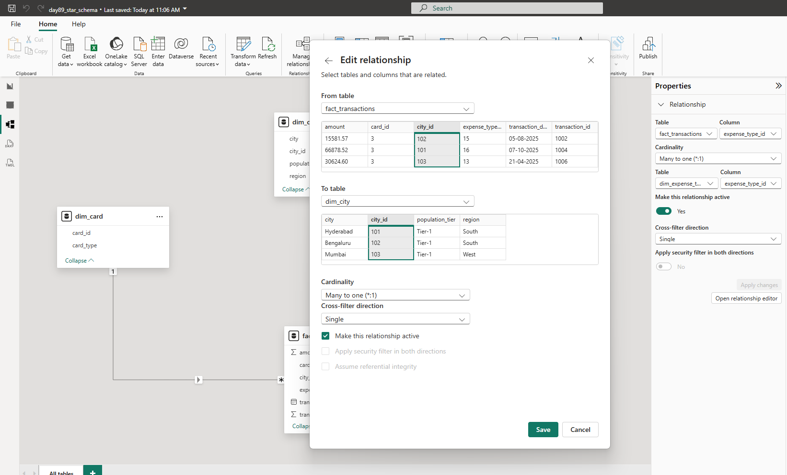
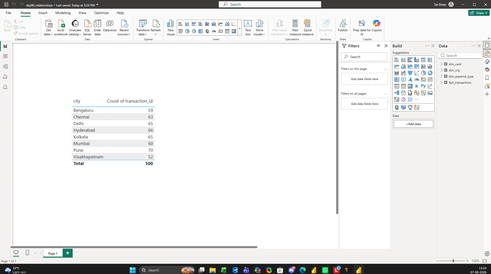

# Day 90 – Data Modelling: Relationships (Cardinality & Cross Filter Direction)

> **Learning Focus:** Power BI Data Modelling | Relationships | Cardinality | Cross Filter Direction | Semantic Model Validation

This project is part of my **120 Days Data Analyst GitHub Worklog**, where I consistently build practical Data Analytics skills through real business scenarios. Building on the Star Schema created in Day 89, today's focus was understanding how relationships control data filtering and why correct cardinality and filter direction are essential for accurate business reporting.

---

# 📌 Business Problem

Incorrect relationship settings in Power BI rarely produce visible errors. Instead, they silently generate incorrect business results, making relationship configuration one of the most critical parts of data modelling.

---

# 🎯 Objective

- To understand relationship cardinality.
- To understand cross filter direction.
- To validate relationship configuration using business logic.
- To understand when Single and Both filter directions should be used.
- To prepare a reliable semantic model for reporting and DAX.

---

# 🏢 Business Scenario

A banking analytics team has already designed a Star Schema for credit card transactions. Before building dashboards, the semantic model must be validated to ensure filters behave correctly and business reports always return accurate results.

---

# 📂 Dataset

**Dataset Type**

Credit Card Transactions (Star Schema)

**Files**

- fact_transactions.csv
- dim_city.csv
- dim_card.csv
- dim_expense_type.csv

**Dataset Used**

The same dataset created during **Day 89** was reused to maintain a consistent semantic model.

---

# 🛠️ Activities Performed

- Continued working with the Star Schema created in Day 89.
- Reviewed all relationships in Model View.
- Verified the business reasoning behind the One-to-Many relationship between Dimension and Fact tables.
- Examined relationship properties, including Cardinality, Cross Filter Direction, Active Relationship, and Security Filter settings.
- Created a simple report to validate that Dimension tables correctly filtered the Fact table.
- Performed a controlled experiment by temporarily changing one relationship from **Single** to **Both** cross filter direction.
- Observed that the report results did not change because the model contained only a single filter path.
- Restored the relationship back to **Single** following Star Schema best practices.
- Understood why bidirectional filtering becomes useful only in specific scenarios such as many-to-many relationships and Row-Level Security.

---

# 🔄 Workflow

```text
Existing Star Schema
        │
        ▼
Review Relationships
        │
        ▼
Understand Cardinality
        │
        ▼
Validate Cross Filter Direction
        │
        ▼
Perform Filter Direction Experiment
        │
        ▼
Restore Best Practice Configuration
        │
        ▼
Validated Semantic Model
```

---

# 📸 Project Screenshots

### 1. Relationship Model

**File:** `screenshot_model_view.png`


Shows the completed Star Schema with correctly configured relationships between the Fact and Dimension tables.

---

### 2. Relationship Configuration

**File:** `screenshot_relationship_editor.png`



Shows the relationship properties, including Many-to-One (*:1) cardinality, Single cross filter direction, and Active relationship status.

---

### 3. Relationship Validation Report

**File:** `screenshot_report_view.png`



Shows a simple report validating that the Dimension table correctly filters the Fact table through the configured relationship.

---

# 💼 Business Outcome

The semantic model was successfully validated by confirming correct relationship behavior, appropriate filter direction, and business-driven cardinality. The model is now ready for time intelligence and DAX development.

---

# 🎓 Key Learning

- Understood that business relationships determine cardinality, not Power BI.
- Learned why **Single** cross filter direction is the recommended default for a Star Schema.
- Verified through experimentation that changing to **Both** does not always change report results in a simple model but can introduce ambiguity in larger enterprise models.

---

# 📈 Project Summary

This project focused on validating relationships within a Power BI Star Schema. The semantic model was reviewed, relationship settings were verified, and a practical experiment demonstrated the impact of cross filter direction. The completed model follows industry best practices and provides a reliable foundation for future DAX calculations and reporting.

---

# 🛠️ Skills Demonstrated

- Power BI
- Data Modelling
- Relationships
- Cardinality
- Cross Filter Direction
- Star Schema
- Semantic Model
- Business Intelligence
- Data Validation

---

# 📁 Project Structure

```text
day90_dm_relationships/
│
├── README.md
├── day90_relationships.pbix
├── fact_transactions.csv
├── dim_city.csv
├── dim_card.csv
├── dim_expense_type.csv
├── screenshot_model_view.png
├── screenshot_relationship_editor.png
└── screenshot_report_view.png
```

---

# 📅 120 Days Data Analyst GitHub Worklog

**Progress:** Day 90 Completed ✅

**Current Focus:** Power BI Data Modelling – Relationships, Cardinality & Cross Filter Direction

---

# 👨‍💻 About Me

I have completed an **MBA in Business Analytics & Data Science** and am building an interview-ready Data Analyst portfolio through practical projects based on real business scenarios. My learning journey focuses on Microsoft Excel, SQL Server, Power BI, Python, Statistics, and Business Analytics while documenting consistent hands-on practice through my GitHub Worklog.

---

# 🤝 Connect With Me

**LinkedIn**

https://www.linkedin.com/in/saideep-pallela

**GitHub**

https://github.com/saideeppallela

---

# ⭐ Thank You

Thank you for visiting this project. If you found it helpful, please consider ⭐ starring the repository to support my learning journey.
