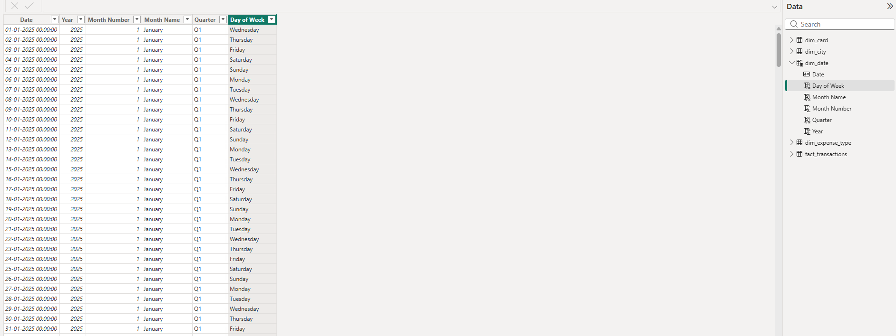
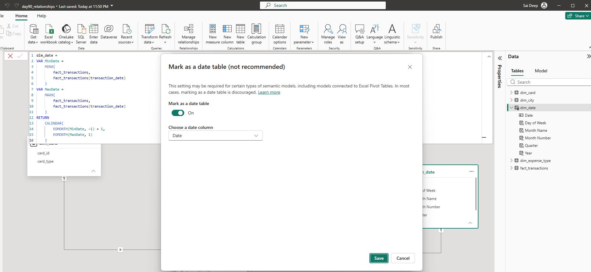

# Day 91 – Power BI Data Modelling: Date Table & Calendar Dimension

> **Learning Focus:** Date Dimension | CALENDAR() | Date Attributes | Month Sorting | Date Relationships | Mark as Date Table

This project is part of my **120 Days Data Analyst GitHub Worklog**. After building the Star Schema in Day 89 and practising relationship cardinality and filter direction in Day 90, I continued the same credit card analytics model by creating a dedicated Date dimension.

The focus was not only on creating a calendar, but on understanding **why a Date Table is required in a Power BI semantic model and how it should be connected to a transaction Fact table**.

---

## 📌 Business Problem

Credit card transaction reports need to answer business questions by time period, such as monthly spending, quarterly performance, and yearly trends.

If the transaction date is used directly from the Fact table, the model becomes less reusable for future time-based analysis. A dedicated Date dimension provides a consistent calendar that can be shared across business reporting.

---

## 🎯 Objective

- To create a dedicated `dim_date` table for the credit card model.
- To generate useful business time attributes from the Date column.
- To ensure months appear in chronological order rather than alphabetical order.
- To create the correct relationship between the Date dimension and transaction Fact table.
- To configure `dim_date` as the model's Date Table.
- To validate that Date attributes correctly filter transaction spending.

---

## 🏢 Business Scenario

The existing credit card model contains transaction-level spending data for 2025.

The model already contains a Star Schema with:

```text
dim_city
dim_card
dim_expense_type
        ↓
fact_transactions
```

For reporting, the business also needs a proper calendar dimension so that transaction amounts can be analysed consistently by year, month, quarter, and day.

Therefore, I extended the existing model by adding:

```text
dim_date
    ↓
fact_transactions
```

---

## 📂 Dataset

**Dataset Type:** Credit Card Transaction Analytics

**Source:** Existing Day 89 Star Schema dataset

**Existing Tables Reused:**

- `fact_transactions`
- `dim_city`
- `dim_card`
- `dim_expense_type`

**New Table Created:**

- `dim_date`

**Transaction Period:** January 2025 – December 2025

### Dataset Approach

No new source CSV files were created for Day 91.

I reused the existing Day 89 model because the objective was to **extend the semantic model**, not create another copy of the same business dataset.

This helped maintain consistency across the Power BI Data Modelling phase.

---

## 🛠️ Activities Performed

### 1. Reviewed the Existing Transaction Date

I first used the existing:

```text
fact_transactions[transaction_date]
```

as the source for determining the calendar range.

The transaction data covered the 2025 reporting period.

---

### 2. Created the `dim_date` Table

I created a new calculated table using `CALENDAR()`.

The calendar boundaries were derived dynamically from the minimum and maximum transaction dates instead of manually typing dates.

The logic used the transaction data to determine the required reporting period and extended the calendar to complete month boundaries.

This makes the Date Table more reusable if the transaction data changes later.

---

### 3. Created Date Attributes

I added the following columns to `dim_date`:

```text
Date
Year
Month Number
Month Name
Quarter
Day of Week
```

Examples of the logic used included:

```DAX
Month Name = FORMAT(dim_date[Date], "MMMM")
```

and:

```DAX
Month Number = MONTH(dim_date[Date])
```

For the quarter:

```DAX
Quarter = "Q" & QUARTER(dim_date[Date])
```

For the day name:

```DAX
Day of Week = FORMAT(dim_date[Date], "dddd")
```

These attributes provide business-friendly fields for grouping and filtering transaction data.

---

### 4. Fixed Month Sorting

During validation, I noticed that the report displayed months alphabetically:

```text
April
August
December
February
January
...
```

This is not appropriate for business reporting.

I therefore configured:

```text
Month Name
      ↓
Sort by
      ↓
Month Number
```

After the change, the report correctly displayed:

```text
January
February
March
April
May
June
July
August
September
October
November
December
```

This was an important modelling validation because a technically correct Date Table can still produce poor reporting results if its attributes are not configured correctly.

---

### 5. Created the Date-to-Fact Relationship

I connected:

```text
dim_date[Date]
        ↓
fact_transactions[transaction_date]
```

The relationship was configured as:

```text
dim_date                  fact_transactions

   Date      1 ─────────────── *      transaction_date
```

The configuration used:

- **Cardinality:** One-to-Many
- **Cross-filter direction:** Single
- **Relationship:** Active

The Date dimension is on the **one side** because each date should occur once in the Date Table, while the same date can appear across many transaction records.

---

### 6. Configured `dim_date` as the Date Table

I opened the Date Table configuration through the Power BI calendar options and enabled:

```text
Mark as a date table
```

with:

```text
Date column = Date
```

This explicitly identifies `dim_date` as the dedicated calendar table used by the model.

---

### 7. Validated the Model Through a Report

Instead of stopping after creating the Date Table, I tested whether the model actually worked.

I created a table visual using:

```text
dim_date[Year]
dim_date[Month Name]
fact_transactions[amount]
```

The visual successfully grouped transaction spending by month.

I also verified that the months appeared in chronological order after applying the Month Number sort.

This confirmed that the Date dimension was correctly filtering the Fact table.

---

## 🔄 Workflow

```text
Existing Credit Card Star Schema
              ↓
Review Transaction Date
              ↓
Determine Transaction Date Range
              ↓
Create dim_date using CALENDAR()
              ↓
Create Date Attributes
              ↓
Year | Month | Quarter | Day
              ↓
Sort Month Name by Month Number
              ↓
Create Date → Fact Relationship
              ↓
1 : * | Single | Active
              ↓
Mark dim_date as Date Table
              ↓
Build Validation Visual
              ↓
Verify Monthly Transaction Spending
```

---

## 📸 Project Screenshots

### 1. Date Model

**File:** `screenshot_model_view.png`


The screenshot shows the updated Power BI model with `dim_date` connected to `fact_transactions` and the existing Star Schema relationships preserved.

---

### 2. Date Table Structure

**File:** `screenshot_date_table.png`



The screenshot shows the created `dim_date` table and its business-friendly attributes: Date, Day of Week, Month Name, Month Number, Quarter, and Year.

---

### 3. Date Table Configuration

**File:** `screenshot_date_table_settings.png`



The screenshot shows the Date Table configuration with the setting enabled and `Date` selected as the Date column.

---

## 💼 Business Outcome

The existing credit card Star Schema was extended with a dedicated Date dimension.

The model now provides a structured calendar for analysing transaction spending by:

- Year
- Quarter
- Month
- Day

The validation visual confirmed that the Date dimension successfully filtered the transaction Fact table and that month reporting followed the correct chronological order.

---

## 🎓 Key Learning

- I understood why a dedicated Date dimension is an important part of a Power BI semantic model instead of relying only on the Fact table's transaction date.
- I learned how to build a dynamic calendar using the minimum and maximum transaction dates rather than hard-coding a fixed date range.
- I understood why `Month Name` must be sorted using `Month Number` for correct business reporting.
- I practised creating a `1:*` Date-to-Fact relationship with Single filter direction.
- I understood how marking a table as a Date Table identifies the official calendar used by the model.
- I validated the model with an actual transaction spending visual instead of assuming the relationship was working.

---

## 📈 Project Summary

In Day 91, I extended the credit card Star Schema created during the previous modelling tasks by building a dedicated `dim_date` table.

I created the calendar dynamically, added common business time attributes, corrected month sorting, created the Date-to-Fact relationship, configured the table as the Date Table, and validated the result using transaction spending.

This exercise strengthened my understanding of how a Power BI semantic model should be prepared before moving into more advanced time-based analysis.

---

## 🛠️ Skills Demonstrated

- Power BI
- Data Modelling
- Star Schema
- Date Dimension
- Calendar Table
- DAX
- CALENDAR
- Calculated Columns
- Relationships
- Cardinality
- Filter Direction
- Date Table Configuration
- Data Validation
- Business Reporting

---

## 📁 Project Structure

```text
day91_dm_date_table/
│
├── README.md
├── day91_date_table.pbix
├── screenshot_model_view.png
├── screenshot_date_table.png
└── screenshot_date_table_settings.png
```

---

## 📅 120 Days Data Analyst GitHub Worklog

**Progress:** Day 91 / 120 — Completed ✅

**Current Focus:** Power BI Data Modelling — Date Dimensions and Calendar Design

---

## 👨‍💻 About Me

I have completed an **MBA in Business Analytics & Data Science** and am building my Data Analyst portfolio through consistent hands-on projects based on practical business scenarios.

My core preparation includes **Microsoft Excel, SQL Server, Power BI, Python, Statistics, and Business Analytics**, with a focus on developing practical problem-solving and interview-ready skills.

---

## 🤝 Connect With Me

**LinkedIn:** [Saideep Pallela](https://www.linkedin.com/in/saideeppallela/)

**GitHub:** [saideeppallela/data-analyst-worklog-2026](https://github.com/saideeppallela/data-analyst-worklog-2026)
---

## ⭐ Thank You

Thank you for visiting my project and following my **120 Days Data Analyst GitHub Worklog**.

If you find the project useful, consider ⭐ starring the repository and following the journey.
