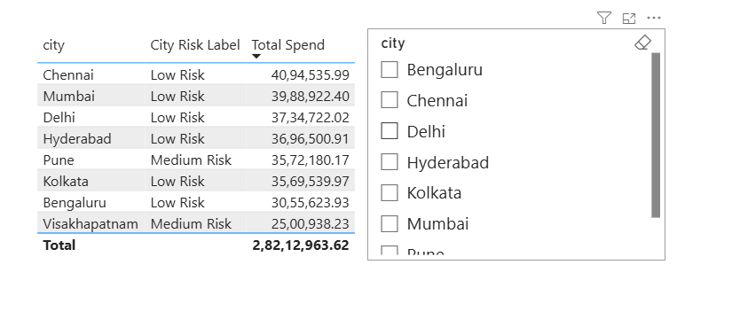
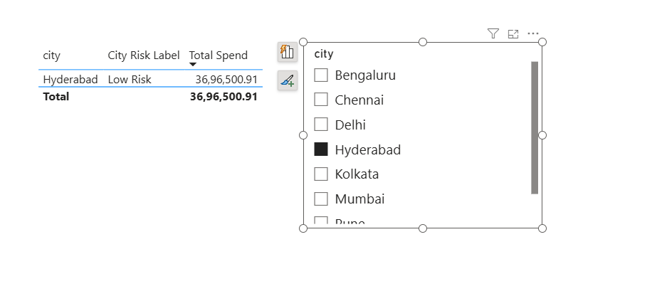
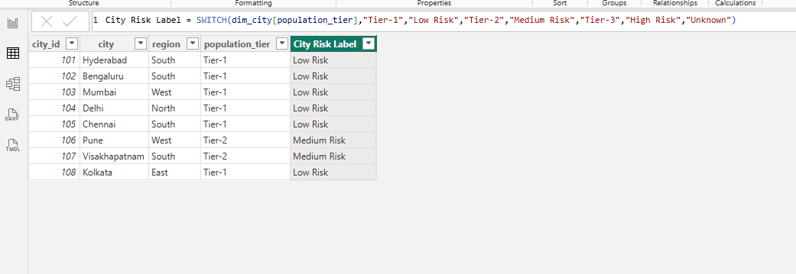

# Day 92 – Power BI Data Modelling: Calculated Columns vs Measures

> **Learning Focus:** Calculated Columns | Measures | Filter Context | DAX | Business Logic | Power BI Data Modelling

Day 92 is part of my **120 Days Data Analyst GitHub Worklog**, where I document my hands-on preparation for a Data Analyst role through practical business scenarios.

Building on the Power BI data model created during Days 89–91, I used the same credit card transaction model to understand a common Power BI modelling decision: **when to use a calculated column and when to use a measure**.

Instead of learning the difference only through theory, I created both, placed them into the same report, applied a city filter, and observed their behaviour.

---

## 📌 Business Problem

Power BI reports require both fixed business attributes and calculations that change according to the user's selections.

If dynamic calculations are incorrectly created as calculated columns, the results can become misleading when users apply filters. On the other hand, creating unnecessary calculated columns can increase model size.

A Data Analyst needs to understand the business requirement first and then choose the appropriate calculation type.

---

## 🎯 Objective

- To create a fixed city-level classification using a calculated column.
- To create a dynamic spending calculation using a measure.
- To compare both approaches inside the same Power BI report.
- To test how each behaves when a city filter is applied.
- To understand filter context through a practical business example.
- To build an interview-ready explanation based on hands-on implementation.

---

## 🏢 Business Scenario

The credit card analytics model contains city-level information and transaction-level spending.

A business user wants to classify cities according to their population tier while also analysing transaction spending dynamically when different cities are selected.

The two requirements need different calculation approaches:

```text
Fixed city-level business attribute
            ↓
    Calculated Column

Dynamic report calculation
            ↓
         Measure
```

---

## 📂 Dataset

**Dataset Type:** Credit Card Transaction Analytics

**Source:** Existing model developed during the previous Power BI Data Modelling sessions.

**New Source Data:** None

The Day 89 model was reused to maintain consistency across the Data Modelling phase.

### Tables Used

- `dim_city`
- `fact_transactions`

### Relevant Columns

**dim_city**

- `city`
- `city_id`
- `population_tier`
- `region`

**fact_transactions**

- `transaction_id`
- `city_id`
- `card_id`
- `expense_type_id`
- `transaction_date`
- `amount`

---

## 🛠️ Activities Performed

### 1. Reused the Existing Day 91 Power BI Model

I created the Day 92 working folder and copied the existing Day 91 Power BI file into it.

The PBIX file was renamed to:

`day92_columns_vs_measures.pbix`

I reused the existing model instead of creating a new dataset because today's objective was to practise calculation behaviour rather than data preparation.

The existing model contained:

- `dim_city`
- `dim_card`
- `dim_expense_type`
- `dim_date`
- `fact_transactions`

This kept the data model consistent with the previous Data Modelling sessions.

---

### 2. Created a City Risk Label Calculated Column

I selected the `dim_city` table and created a new calculated column named:

`City Risk Label`

The business rule was based on the existing `population_tier` column.

The DAX used was:

```DAX
City Risk Label =
SWITCH(
    dim_city[population_tier],
    "Tier-1", "Low Risk",
    "Tier-2", "Medium Risk",
    "Tier-3", "High Risk",
    "Unknown"
)
```

The rule classified cities as:

```text
Tier-1 → Low Risk
Tier-2 → Medium Risk
Tier-3 → High Risk
```

I used a calculated column because the risk classification belongs to the city record itself.

For example, once Hyderabad was classified as `Low Risk`, that classification remained associated with Hyderabad regardless of transaction-level filtering.

---

### 3. Created a Total Spend Measure

I then selected the `fact_transactions` table and created a measure named:

`Total Spend`

The DAX used was:

```DAX
Total Spend =
SUM(fact_transactions[amount])
```

I created this as a measure because total spending needs to respond to the current report filter context.

For example, the same measure should be able to calculate:

```text
All Cities
    ↓
Total spending across all transactions

Hyderabad selected
    ↓
Only Hyderabad transaction spending

Another city selected
    ↓
Spending for that selected city
```

This made `Total Spend` a suitable measure rather than a fixed calculated column.

---

### 4. Built a Comparison Table

I created a Power BI table visual and added:

```text
dim_city[city]
dim_city[City Risk Label]
fact_transactions[Total Spend]
```

The visual allowed me to see the fixed city classification and dynamic spending calculation together.

Before applying a city filter, the report showed:

```text
Total Spend = ₹2,82,12,963.62
```

The table contained city-level risk classifications and their corresponding spending values.

---

### 5. Added a City Slicer

To test filter behaviour, I added a **City slicer** to the report.

The slicer contained the available cities from `dim_city`.

I initially kept the slicer cleared so that all cities were visible.

This created the baseline required for the filter-context experiment.

---

### 6. Tested the Model Using Hyderabad

I selected **Hyderabad** from the City slicer.

The report then displayed:

```text
City Risk Label → Low Risk
Total Spend      → ₹36,96,500.91
```

This was the most important practical experiment of Day 92.

The `City Risk Label` remained `Low Risk` because it was already stored as a calculated-column value for the Hyderabad city record.

The `Total Spend` changed to `₹36,96,500.91` because the measure recalculated using the transactions available within the Hyderabad filter context.

---

### 7. Compared Calculated Column vs Measure Behaviour

The experiment helped me understand the difference through actual report behaviour rather than memorising definitions.

```text
City Risk Label
        ↓
Calculated Column
        ↓
Fixed city-level result

Total Spend
        ↓
Measure
        ↓
Dynamic result based on filter context
```

The practical rule I derived from the exercise was:

> **If the answer depends on what's filtered right now, it's a measure; if it's a fixed per-row fact, it's a calculated column.**

---

### 8. Verified the DAX

After completing the experiment, I selected the calculated column and measure individually and verified their DAX definitions in Power BI.

**Calculated Column:**

```DAX
City Risk Label =
SWITCH(
    dim_city[population_tier],
    "Tier-1", "Low Risk",
    "Tier-2", "Medium Risk",
    "Tier-3", "High Risk",
    "Unknown"
)
```

**Measure:**

```DAX
Total Spend =
SUM(fact_transactions[amount])
```

This final verification helped ensure that the model implementation matched the intended business logic.

---

### 9. Documented the Hands-on Evidence

I captured three screenshots during the exercise:

1. The comparison table with the City slicer.
2. The Hyderabad filter-context result.
3. The calculated-column DAX definition.

These screenshots document the actual implementation rather than only describing the concepts in the README.

---

## 🔄 Workflow

```text
Existing Day 91 Power BI Model
            ↓
Create Day 92 Working Copy
            ↓
Review dim_city and fact_transactions
            ↓
Create City Risk Label Calculated Column
            ↓
Create Total Spend Measure
            ↓
Build Comparison Table
            ↓
Add City Slicer
            ↓
Keep All Cities as Baseline
            ↓
Select Hyderabad
            ↓
Observe Filter Context
            ↓
Compare Column vs Measure Behaviour
            ↓
Verify DAX
            ↓
Capture Screenshots
```

---

## 📸 Project Screenshots

### 1. Column vs Measure Comparison

**Filename:** `screenshot_column_vs_measure.png`



The screenshot showed the comparison table containing `City`, `City Risk Label`, and `Total Spend`, along with the City slicer before applying the filter.

It documented the baseline report state before testing filter context.

---

### 2. Measure Filter Context

**Filename:** `screenshot_measure_filter_context.png`



The screenshot showed the report after selecting Hyderabad from the City slicer.

It documented the filtered result where `Total Spend` changed to **₹36,96,500.91** while `City Risk Label` remained **Low Risk**.

---

### 3. Calculated Column DAX

**Filename:** `screenshot_calculated_column.png`



The screenshot showed the `City Risk Label` calculated column and its DAX formula using the population-tier business rule.

---

## 💼 Business Outcome

The hands-on exercise demonstrated how different Power BI calculation types support different business requirements.

The city risk classification remained a fixed city-level attribute, while total spending responded dynamically to the selected city.

The Hyderabad experiment produced:

**₹36,96,500.91**

for Total Spend, demonstrating that the measure responded to the active filter context.

This practical comparison helped me understand why choosing the correct calculation type is important for reliable Power BI reporting.

---

## 🎓 Key Learning

- I understood that calculated columns were suitable for fixed row-level or entity-level attributes.
- I understood that measures were suitable for calculations that needed to respond to the current filter context.
- I practised using `SWITCH()` to implement a business classification rule.
- I practised using `SUM()` to create a dynamic spending measure.
- I tested filter context using a City slicer instead of relying only on theoretical definitions.
- I verified that Hyderabad's `Total Spend` changed to **₹36,96,500.91** after filtering.
- I understood why dynamic calculations such as percentage of total sales should generally be implemented as measures when they need to respond to report filters.
- I developed a practical interview example that I can explain from my own hands-on work.

---

## 📈 Project Summary

In Day 92, I extended the existing credit card Power BI model to practise the difference between calculated columns and measures.

I created a `City Risk Label` calculated column using population tiers and a `Total Spend` measure using transaction amounts. I then built a comparison table, added a City slicer, and filtered the report to Hyderabad.

The experiment showed that the calculated column retained its fixed city-level classification while the measure recalculated according to the active filter context.

This exercise strengthened my understanding of Power BI calculation behaviour and gave me a practical example that I can demonstrate during Data Analyst or Power BI interviews.

---

## 💼 Interview Angle

### Interview Question

> **What is the difference between a calculated column and a measure in Power BI, and when would you use each?**

### My Answer

> I use a calculated column when I need a fixed value calculated for each row or entity, such as my City Risk Label based on population tier. I use a measure when the result needs to change according to the current filter context, such as Total Spend. In my Day 92 hands-on exercise, I filtered the report to Hyderabad and Total Spend recalculated to ₹36,96,500.91, while the City Risk Label remained Low Risk.

### Simple Rule I Can Say in an Interview

> **If the answer depends on what's filtered right now, it's a measure; if it's a fixed per-row fact, it's a calculated column.**

### Real Hands-on Example

> **“Yes, I have tested this practically. In my Day 92 Power BI project, I created City Risk Label as a calculated column and Total Spend as a measure. When I filtered the report to Hyderabad, Total Spend changed to ₹36,96,500.91, while the City Risk Label remained Low Risk.”**

---

## 🛠️ Skills Demonstrated

- Power BI
- DAX
- Calculated Columns
- Measures
- Filter Context
- SWITCH
- SUM
- Data Modelling
- Business Logic
- Report Filtering
- Data Validation
- Interview Preparation

---

## 📁 Project Structure

```text
day92_dm_columns_vs_measures/
│
├── README.md
├── day92_columns_vs_measures.pbix
├── screenshot_column_vs_measure.png
├── screenshot_measure_filter_context.png
└── screenshot_calculated_column.png
```

---

## 📅 120 Days Data Analyst GitHub Worklog

**Progress:** Day 92 / 120 — Completed ✅

**Current Focus:** Power BI Data Modelling — Calculated Columns vs Measures

**Previous:** Day 91 — Date Table, CALENDAR DAX & Mark as Date Table

**Current:** Day 92 — Calculated Columns vs Measures

**Next:** Day 93 — Continuing Power BI Data Modelling

---

## 👨‍💻 About Me

I am an **MBA (Business Analytics & Data Science)** learner preparing for a Data Analyst career through consistent hands-on projects and practical business scenarios.

My preparation focuses on **Microsoft Excel, SQL Server, Power BI, Python, Statistics, and Business Analytics**, with an emphasis on practical problem-solving, business understanding, and interview readiness.

---

## 🤝 Connect With Me

**LinkedIn:** [Saideep Pallela](https://www.linkedin.com/in/saideep-pallela/)

**GitHub:** [saideeppallela](https://github.com/saideeppallela)

---

## ⭐ Thank You

Thank you for visiting my **120 Days Data Analyst GitHub Worklog** and following my learning journey.

If you found this project useful, consider ⭐ starring the repository and following the journey.

---

