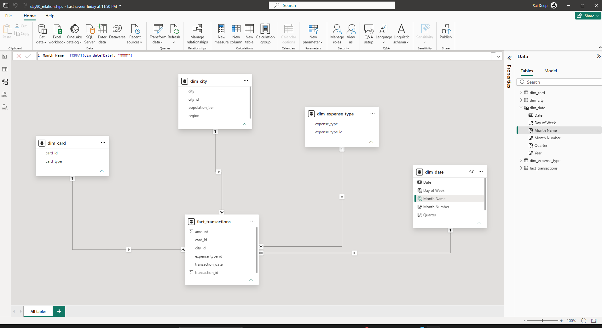
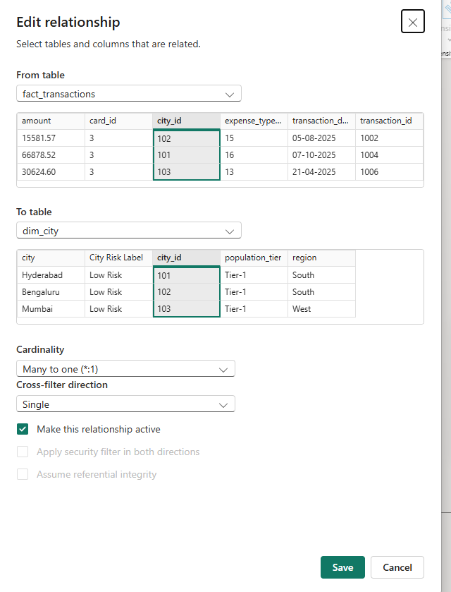

# Day 93 – Power BI Data Model Review & Interview Walkthrough

> **Learning Focus:** Power BI Data Modelling | Star Schema | Relationships | Date Table | Calculated Columns vs Measures | Data Validation | Interview Readiness

Day 93 is part of my **120 Days Data Analyst GitHub Worklog** and marks the completion of my **Power BI Data Modelling stage (Days 89–93)**.

Instead of creating a new dataset, I reviewed the Power BI model built during the previous Data Modelling sessions. The focus was to validate the model, understand the reasoning behind each modelling decision, and practise explaining the model clearly before moving into DAX.

---

## 📌 Business Problem

The transaction data needs to support analysis across different business dimensions such as:

* Card
* City
* Expense Type
* Date

An incorrectly designed Power BI model can lead to incorrect aggregations, unexpected filter behaviour, and difficult DAX calculations.

Before starting DAX, I therefore reviewed the existing model to confirm that the fact table, dimensions, relationships, Date table, and calculations were correctly structured.

---

## 🎯 Objective

To:

* Review the existing star schema.
* Validate the fact and dimension tables.
* Audit all four relationships.
* Verify cardinality and filter direction.
* Validate dimension-key uniqueness.
* Validate the dedicated Date table.
* Review calculated-column and measure usage.
* Confirm the fact-table grain.
* Perform basic data-quality checks.
* Practise Power BI interview questions.
* Explain the complete model in a short spoken walkthrough.

---

## 🏢 Business Scenario

The model represents a **customer transaction analysis scenario**.

Each transaction contains information such as transaction ID, transaction date, city, card, expense type, and amount spent.

The model separates transactional data from descriptive business information.

### Model Structure

| Table               | Role      | Purpose                                                     |
| ------------------- | --------- | ----------------------------------------------------------- |
| `fact_transactions` | Fact      | Stores individual transaction records and measurable values |
| `dim_card`          | Dimension | Provides card-related information                           |
| `dim_city`          | Dimension | Provides city-related information                           |
| `dim_expense_type`  | Dimension | Provides expense-type information                           |
| `dim_date`          | Dimension | Provides calendar and time-analysis attributes              |

The resulting structure follows a **star schema**, with `fact_transactions` at the centre and the four dimension tables connected to it.

---

## 📂 Dataset

### Dataset Type

Transaction-level analytical dataset.

### Dataset Used

The existing transaction dataset from the previous Power BI Data Modelling sessions was reused.

**No new dataset was created on Day 93 because this was a model review and validation day.**

### Tables Reviewed

* `fact_transactions`
* `dim_card`
* `dim_city`
* `dim_expense_type`
* `dim_date`

---

## 🛠️ Activities Performed

### 1. Reviewed the Existing Model

I opened **Model View** and reviewed the complete relationship structure.

I confirmed that:

* `fact_transactions` was the central fact table.
* `dim_card` was connected to the fact table.
* `dim_city` was connected to the fact table.
* `dim_expense_type` was connected to the fact table.
* `dim_date` was connected to the fact table.

This confirmed the intended star-schema structure.

---

### 2. Audited All Four Relationships

I opened each relationship individually and verified the relationship configuration.

| Dimension          | Fact Key          | Cardinality         | Filter Direction | Status |
| ------------------ | ----------------- | ------------------- | ---------------- | ------ |
| `dim_card`         | `card_id`         | Many-to-one (`*:1`) | Single           | Active |
| `dim_city`         | `city_id`         | Many-to-one (`*:1`) | Single           | Active |
| `dim_expense_type` | `expense_type_id` | Many-to-one (`*:1`) | Single           | Active |
| `dim_date`         | `Date`            | Many-to-one (`*:1`) | Single           | Active |

The relationships followed the expected star-schema pattern:

**Dimension → Fact**

This provided predictable filter propagation from descriptive dimensions to transaction data.

---

### 3. Validated Dimension-Key Uniqueness

I checked the keys on the one side of the relationships:

* `dim_card[card_id]`
* `dim_city[city_id]`
* `dim_expense_type[expense_type_id]`
* `dim_date[Date]`

No duplicates were identified.

This supported the intended one-to-many relationship design.

---

### 4. Validated the Date Table

I reviewed `dim_date` and confirmed the presence of:

* Date
* Year
* Month Number
* Month Name
* Quarter
* Day of Week

I also checked that the Date column was continuous.

During the review, I identified that the table needed to be explicitly marked as the model's Date table.

I corrected this using:

**Table tools → Calendar options → Mark as date table**

and selected:

`dim_date[Date]`

After saving the configuration, the Date table was correctly marked.

This created the calendar foundation required for consistent date filtering and future DAX time-intelligence calculations.

---

### 5. Defined the Fact-Table Grain

I explicitly identified the grain of `fact_transactions` as:

> **One row represents one individual customer transaction.**

Each transaction contains:

* `transaction_id`
* `transaction_date`
* `city_id`
* `card_id`
* `expense_type_id`
* `amount`

I checked `transaction_id` and found no duplicate transaction IDs.

This confirmed that the fact table represented transaction-level events rather than one row per customer.

---

### 6. Validated Foreign-Key Completeness

I checked the following fact-table fields for blank or null values:

* `card_id`
* `city_id`
* `expense_type_id`
* `transaction_date`

No blank or null values were found.

This provided confidence that the transaction records contained the required references to the model dimensions.

---

### 7. Validated Relationship Data Types

I checked the data types of the relationship columns.

| Column                                | Data Type    |
| ------------------------------------- | ------------ |
| `fact_transactions[card_id]`          | Whole number |
| `fact_transactions[city_id]`          | Whole number |
| `fact_transactions[expense_type_id]`  | Whole number |
| `fact_transactions[transaction_date]` | Date         |
| `dim_date[Date]`                      | Date         |

The relationship columns used compatible data types.

---

### 8. Reviewed the Calculated Column

I reviewed the existing `City Risk Label` calculated column.

The logic used was:

`City Risk Label = SWITCH(dim_city[population_tier], "Tier-1", "Low Risk", "Tier-2", "Medium Risk", "Tier-3", "High Risk", "Unknown")`

I confirmed that this was appropriate as a calculated column because it produces a **row-level classification**.

The classification was:

* Tier-1 → Low Risk
* Tier-2 → Medium Risk
* Tier-3 → High Risk

This type of field can be used for filtering and grouping.

---

### 9. Reviewed the Measure

I reviewed the existing `Total Spend` measure.

The logic used was:

`Total Spend = SUM(fact_transactions[amount])`

I confirmed that `Total Spend` was correctly created as a **measure** rather than a calculated column.

This was appropriate because the result needs to change dynamically according to the current filter context.

For example, the same measure can be used to analyse:

* Overall spend
* City-wise spend
* Card-wise spend
* Expense-type spend
* Year-wise spend

---

### 10. Validated the `amount` Column

I checked the `amount` column because it is used by the `Total Spend` measure.

| Check             | Result         |
| ----------------- | -------------- |
| Data type         | Decimal number |
| Blank/null values | None found     |
| Negative values   | None found     |
| Zero values       | None found     |

This provided a basic data-quality validation for transaction amounts.

---

### 11. Practised Filter-Direction Reasoning

I reviewed why the relationships use **Single** cross-filter direction.

The intended flow is:

**Dimension → Fact**

For example:

`dim_city → fact_transactions`

Selecting a city should filter the corresponding transaction records.

I also reinforced why bidirectional filtering should not be used unnecessarily. In a standard star schema, unnecessary bidirectional relationships can create ambiguous filter paths and make model behaviour harder to understand and troubleshoot.

---

### 12. Practised Calculated Column vs Measure

I compared the two calculations used in the model.

**Calculated Column — `City Risk Label`**

Used for:

> Row-level classification.

**Measure — `Total Spend`**

Used for:

> Dynamic aggregation based on filter context.

The practical distinction I reinforced was:

**Calculated Column = Row-level value**

**Measure = Dynamic calculation**

---

### 13. Performed Rapid-Fire Interview Practice

I tested myself with questions covering:

1. Why use a star schema?
2. Why use one-to-many relationships?
3. Why use single filter direction?
4. Why use a dedicated Date table?
5. What is the difference between a calculated column and a measure?
6. How would I troubleshoot an incorrect DAX result?

One important lesson was that I should not immediately change DAX when a measure produces an unexpected result.

My troubleshooting approach became:

**Model → Relationships → Cardinality → Filter Direction → Key Uniqueness → Fact Grain → Filter Context → DAX**

---

### 14. Completed a Spoken Model Walkthrough

The main purpose of Day 93 was to make sure I could explain my own model without depending on written notes.

I recorded myself explaining the model using the following structure:

**Business Purpose → Fact Table & Grain → Dimension Tables → Relationships → Date Table → Calculated Column & Measure → Star Schema Benefits → DAX Readiness**

This exercise helped me identify areas where my understanding was correct but my interview terminology needed to be more precise.

---

## 🔄 Workflow

**Existing Power BI Model**
↓
**Model View Review**
↓
**Fact & Dimension Validation**
↓
**Relationship Audit**
↓
**Cardinality Validation**
↓
**Filter Direction Validation**
↓
**Dimension-Key Uniqueness Check**
↓
**Fact-Table Grain Validation**
↓
**Foreign-Key Completeness Check**
↓
**Date Table Validation**
↓
**Date Table Marking**
↓
**Calculated Column Review**
↓
**Measure Review**
↓
**Amount Data-Quality Check**
↓
**Interview Practice**
↓
**2-Minute Spoken Walkthrough**
↓
**Model Ready for DAX**

---

## 📸 Project Screenshots

### 1. Power BI Model View

**Filename:** `screenshot_model_view.png`



The screenshot showed the complete model structure with `fact_transactions` connected to the four dimension tables.

---

### 2. Relationship Configuration Audit

**Filename:** `screenshot_relationship_audit.png`



The screenshot showed the relationship configuration, including the relationship keys, many-to-one cardinality, single cross-filter direction, and active relationship setting.

---

### 3. Date Table Configuration

**Filename:** `screenshot_date_table_marked.png`


The screenshot showed the `dim_date` table being marked as the official Date table using the `Date` column.

> **Note:** I will keep only the screenshots that I actually captured and saved in the project folder.

---

## 💼 Business Outcome

The model review confirmed that the Power BI transaction model followed a clear star-schema structure and that the main relationships, keys, Date table, calculated column, and measure were configured appropriately.

The review also helped me identify and correct one modelling issue: the dedicated `dim_date` table needed to be marked as the official Date table.

After the correction, the model was validated for the upcoming DAX stage.

More importantly, I moved beyond simply creating relationships and focused on understanding:

* Why the model is structured this way
* How filters propagate
* Why relationship direction matters
* Why fact-table grain matters
* When to use calculated columns
* When to use measures
* How the model affects DAX

---

## 🎓 Key Learning

* Identified the exact grain of a transaction fact table.
* Distinguished fact tables from dimension tables.
* Understood the practical purpose of a star schema.
* Validated one-to-many dimension-to-fact relationships.
* Understood why dimension keys must be unique.
* Understood why single-direction filtering is preferred in a standard star schema.
* Validated foreign-key completeness.
* Validated relationship data types.
* Validated a continuous Date table.
* Marked `dim_date` correctly as the Date table.
* Understood the importance of a dedicated Date table for time analysis.
* Distinguished calculated columns from measures.
* Validated a row-level calculated column.
* Validated a dynamic aggregation measure.
* Practised troubleshooting the model before changing DAX.
* Practised explaining a Power BI model in an interview.
* Strengthened the modelling foundation required for DAX.

---

## 📈 Project Summary

Day 93 completed my **Power BI Data Modelling stage**.

Instead of creating another dataset, I reviewed the model built during Days 89–92 and performed a structured audit of its fact table, dimensions, relationships, Date table, calculated column, measure, keys, data types, and basic data quality.

The review also included interview practice and a recorded two-minute model walkthrough.

The most important takeaway was that **building a Power BI model is not enough**. I need to understand its grain, relationships, dimensions, filter flow, and calculation design well enough to explain and troubleshoot them.

With the model reviewed and validated, I am now ready to move into the **DAX stage**, where the quality of this model will directly affect the calculations I build.

---

## 🛠️ Skills Demonstrated

* Power BI
* Data Modelling
* Star Schema
* Fact Tables
* Dimension Tables
* Relationships
* Cardinality
* Cross-Filter Direction
* Date Tables
* Data Validation
* Data Quality
* Calculated Columns
* DAX Measures
* Filter Context
* Business Analysis
* Interview Preparation

---

## 📁 Project Structure

```
05_powerbi_fundamentals/
└── day93_powerbi_data_model_review/
    ├── day93_powerbi_data_model_review.pbix
    ├── README.md
    ├── screenshot_model_view.png
    ├── screenshot_relationship_audit.png
    └── screenshot_date_table_marked.png
```

---

## 📅 120 Days Data Analyst GitHub Worklog

**Progress:** Day 93 / 120

**Current Focus:** Power BI Data Modelling — Stage Complete

### Learning Progress

**Days 84–88:** Power Query
**Days 89–93:** Data Modelling
**Day 94+:** DAX
**Next:** Data Visualization → End-to-End Power BI Projects

Day 93 marked the completion of my **Power BI Data Modelling stage** and established the model foundation required for DAX development.

---

## 👨‍💻 About Me

I am an **MBA student specializing in Business Analytics & Data Science** and an aspiring **Data Analyst** focused on developing practical, industry-relevant analytical skills.

I am building my skills through consistent hands-on practice with business scenarios and documenting my progress through this **120 Days Data Analyst GitHub Worklog**.

My current learning focus includes:

* Microsoft Excel
* SQL Server
* Power BI
* Python
* Statistics
* Business Analytics

---

## 🤝 Connect With Me

**LinkedIn:** [linkedin.com/in/saideep-pallela](https://www.linkedin.com/in/saideep-pallela)

**GitHub:** [github.com/saideeppallela](https://github.com/saideeppallela)

---

## ⭐ Thank You

Thank you for visiting my **120 Days Data Analyst GitHub Worklog**.

If you found this project useful, consider giving the repository a ⭐ and exploring the other practical projects in my Data Analytics learning journey.
